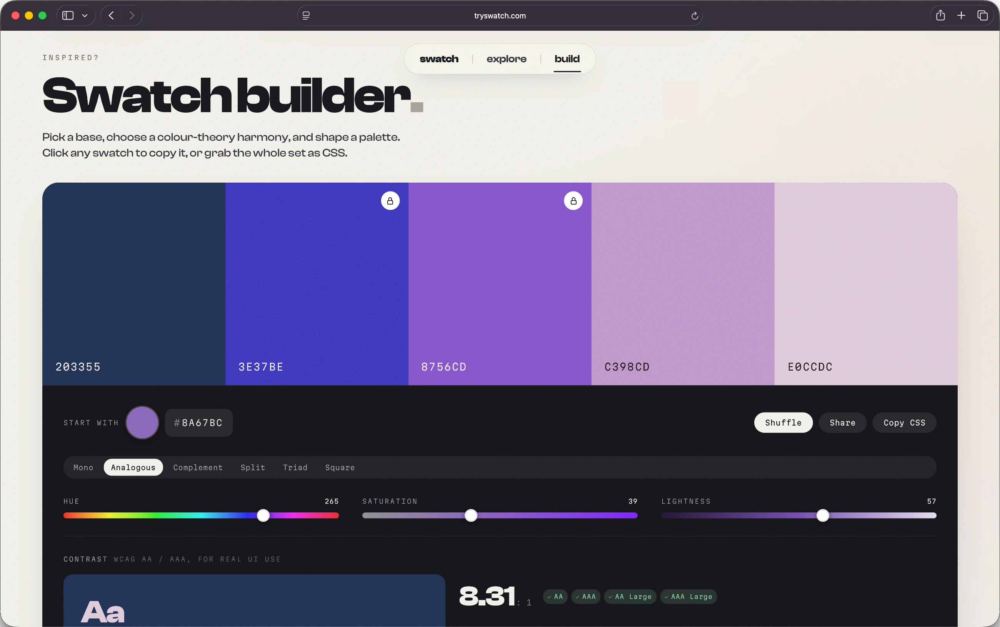
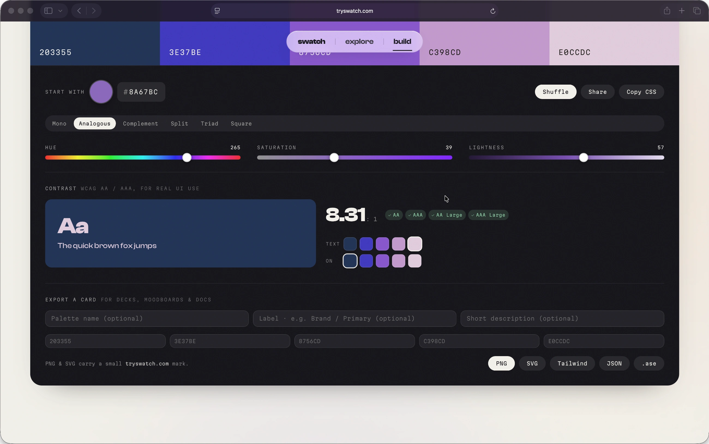
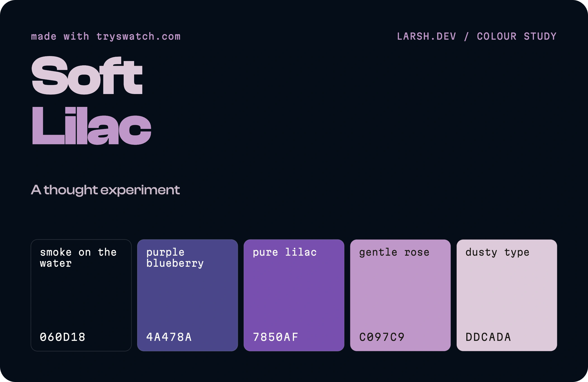
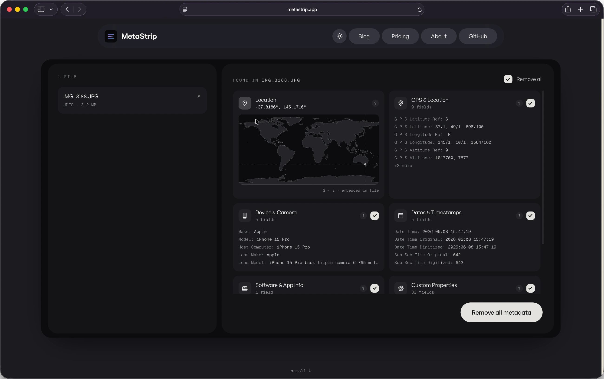
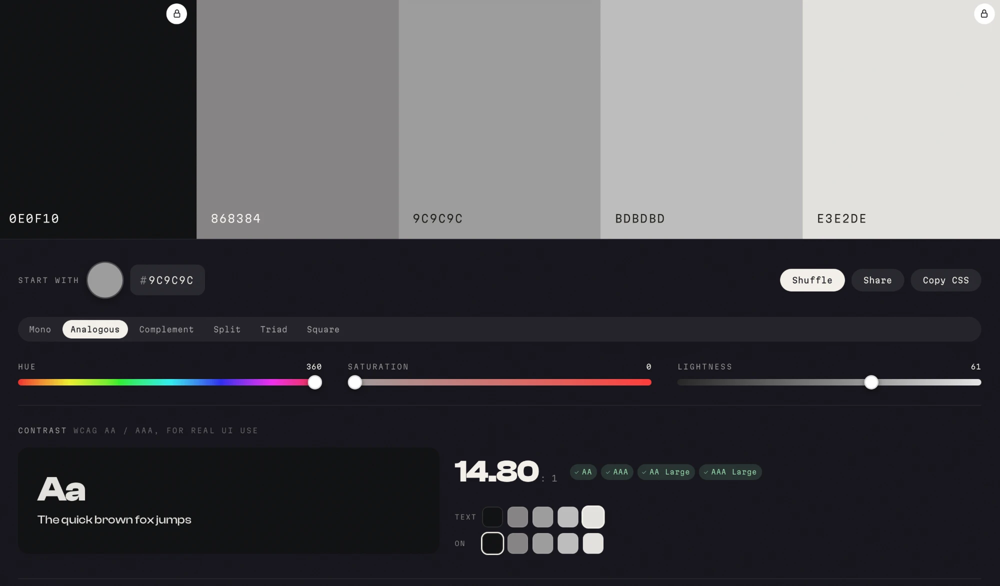

I used to take landscape photos. For a few years I took it fairly seriously: standing in cold places before sunrise, then spending an even more disproportionate amount of time back home pushing the same five sliders around in Lightroom, convinced that this time the greens were finally right. They were never finally right.

These days the camera mostly gathers dust. The hobby went quiet, the way hobbies do, and I shoot maybe a handful of times a year now. But the part that stuck, the part that turned out to be load-bearing, was the colour.

Somewhere along the way the editing had stopped being about fixing photos and started being about colour for its own sake. I got into grading. Proper grading, the kind where you stop trusting the auto white balance and start building your own looks, then baking them into LUTs so you can apply the same mood across a whole set without redoing the work. It was a deeply satisfying hobby and a completely irrational one, because the audience for "I shifted the shadows two degrees toward teal" is exactly one person, and he already knows.

The thing nobody warns you about is that once you start thinking in looks, you start seeing palettes everywhere. A roasted-clay cliff face at golden hour stops being a cliff and becomes four warm neutrals and one accent you will think about for a week. I started keeping colours. Screenshots, hex codes in notes, little swatch files. The photography eventually trailed off. The habit of hoarding colour did not, and that is the bit that quietly suggests you should build a tool, which is the most dangerous suggestion a programmer can hear.

## The bill that pushed me over the edge

Here is the part where I get to be unfair to Adobe.

For years I paid the tax. Lightroom and Photoshop, every month, forever, in exchange for software I mostly used to do about six things. The price went up. It always goes up. You are not buying a tool, you are renting a hostage situation, and the hostage is your own back catalogue of edits. The day I realised I was paying an annual sum that could have bought a very nice lens, purely so I could occasionally heal out a stray tourist, I started looking for the exit. The more I shot, the less the maths bothered me. The less I shot, the more galling it got, which is a special kind of insult: paying full rent on a tool you have half stopped using.

The exit, it turns out, was Apple. I moved my grading over to Pixelmator Pro and my photo editing to Photomator. Pay once, or near enough, and own the thing. They are fast, they are native, they do not nag me to upgrade my plan, and the colour tools are genuinely good. Is it a perfect one-to-one replacement for two decades of Adobe muscle memory? No. Did I miss the subscription? Reader, I did not.

What surprised me was how much the switch changed how I thought about colour. Stripped of the Adobe machinery I was used to, I started paying more attention to the actual relationships between colours rather than the panel I happened to be dragging them in. Which brings us, finally, to the irrational tool.

## So I built the palette tool

Swatch is the tool that leftover habit eventually demanded. You pick a base, choose a colour-theory harmony, and it builds you a usable set. You can lock a swatch you like and let the rest re-harmonise around it, which is the digital version of keeping one colour and changing your mind about everything else. Every hex is real, selectable text. Click it, it copies. There is a live WCAG contrast checker, because a palette that looks gorgeous and fails accessibility is just a nice way to fail accessibility.

Under the hood it is less mystical than the phrase "colour theory" makes it sound. Each harmony is just a small table of offsets in HSL space, applied to whatever base you hand it. If you have ever built a LUT, nudging hue and luminance until a look finally holds together, this will feel suspiciously familiar:

```js
// each harmony is five swatches as [hueOffset, satOffset, lightOffset] from the base,
// shaped to land a deep anchor, the base, the theory accents, and a light tint.
// every harmony keeps a [0,0,0] swatch so the chosen base colour always appears exactly.
var HARMONIES = {
  monochrome:    { label:'Mono',       sw:[[0,6,-42],[0,2,-22],[0,0,0],[0,-12,18],[0,-24,33]] },
  analogous:     { label:'Analogous',  sw:[[-46,6,-34],[-22,1,-9],[0,0,0],[24,-5,13],[46,-15,27]] },
  complementary: { label:'Complement', sw:[[0,6,-36],[0,1,-8],[0,0,0],[180,0,-2],[180,-16,28]] },
  split:         { label:'Split',      sw:[[0,6,-34],[0,0,0],[150,-2,5],[210,-3,-4],[0,-20,30]] },
  triad:         { label:'Triad',      sw:[[0,6,-36],[0,0,0],[120,-4,2],[240,-6,-3],[0,-22,32]] },
  square:        { label:'Square',     sw:[[0,0,0],[90,-6,5],[180,-8,-2],[270,-6,5],[0,8,-38]] }
};
```

That `[0,0,0]` row in every harmony is the one rule I refused to break: the exact colour you picked always survives, untouched. The rest just orbit it.



The contrast checker is the unglamorous half, and the half I actually care about. No magic, just the WCAG relative-luminance maths, doing the thing browsers should arguably do for you:

```js
function relLum(hex){
  var f = function(h){ var v = parseInt(h, 16) / 255; return v <= 0.03928 ? v / 12.92 : Math.pow((v + 0.055) / 1.055, 2.4); };
  return 0.2126 * f(hex.substr(1,2)) + 0.7152 * f(hex.substr(3,2)) + 0.0722 * f(hex.substr(5,2));
}
function contrastRatio(a, b){ var l1 = relLum(a) + 0.05, l2 = relLum(b) + 0.05; return l1 > l2 ? l1 / l2 : l2 / l1; }
```



When you have something you like, you can export it as a PNG or SVG card, or as Tailwind config, JSON tokens, or an Adobe `.ase` file, which I include partly out of usefulness and partly out of spite.



It also ships with twelve palettes I hand-tuned, which is a polite way of saying I spent far too long arguing with myself about whether "Saffron Static" needed to be one notch warmer. It did.

## The first time it earned its keep

For all the photography origin story, the first time Swatch did real work had nothing to do with a camera. I used it to rebuild the entire colour system for [Metastrip](https://metastrip.app), a small app of mine that needed its palette dragged into something coherent.

The process was almost embarrassingly quick. I picked a base, locked the one brand colour I was not willing to lose, let the harmonies do the arguing, and ran every text-on-background pairing through the contrast checker before any of it went near production. What used to be an afternoon of nudging hex codes in a spreadsheet and squinting was about five minutes, most of which was me deciding I liked it. The greens, for once, were finally right.

 

## The boring decisions I am quietly proud of

The whole thing is a single HTML file. No build step, no framework, no node_modules quietly metastasising in a folder. Fonts and libraries are self-hosted, so the page makes essentially no third-party calls. It works with JavaScript turned off, it respects reduced-motion, and it targets WCAG AA, because a colour tool that ignores accessibility would be embarrassing in a specific and deserved way.

There is some quiet showing off. A soft three.js wash drifting behind everything, a faint paper grain, a spring easing curve on every transition that I will not be talking anyone out of. The wordmark is set in Clash Display because some days you just want an oversized full stop.

On the matter of tracking: there is analytics, but it is cookieless, it stores nothing on your device, and if your browser says Do Not Track it loads precisely nothing. Not "loads, then politely opts out". It never downloads in the first place:

```js
// Honour Do Not Track: if it is set, the analytics script is never loaded or fetched.
var dnt = navigator.doNotTrack || window.doNotTrack || navigator.msDoNotTrack;
if (dnt === '1' || dnt === 'yes' || dnt === true) return;
```

I wanted to know if anyone used the thing without becoming the kind of website I close immediately.

## Was it worth it

Probably not, by any sensible measure. I built a free colour tool to solve a problem that mostly affects me and a handful of other people who think in palettes. But it is fast, it is mine, it does not charge rent, it has already rebuilt one app's entire colour system, and it scratched the exact itch that a now-dormant photography hobby and one too many Adobe invoices left behind.

If you design things, build sites, or just like staring at colours that get along, have a play. It is free, there are no accounts, and nothing about your visit follows you home.

You can find it at [tryswatch.com](https://tryswatch.com). The camera is still in the drawer. The colours, at least, are finally sorted.
